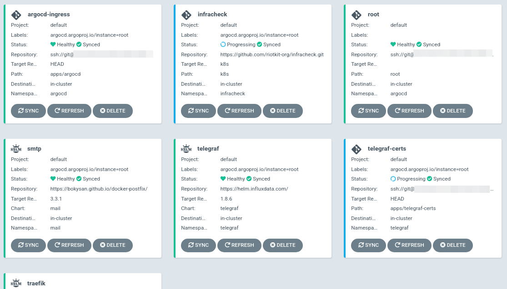
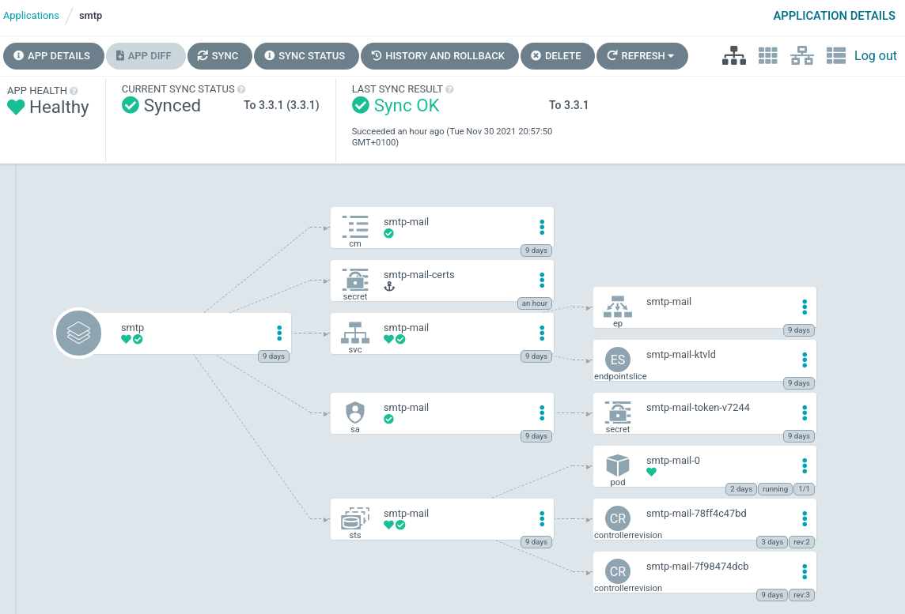

K3S Riotkit Cluster "Space Harbor"
==================================

DANGER: This project is highly in WORK IN PROGRESS state. Subscribe this repository for releases if you want to be notified. We will release soon.

Creates a lightweight, opinionated single-node or multi-node cluster managed fully by ArgoCD.
Requires write access to GIT repository.

GitOps flow
-----------






How it is installed
-------------------


Proposed VPN setup
------------------

This Ansible setup can handle multiple setups:
- One primary, no any compute nodes
- One primary + multiple compute nodes in same network without VPN
- One primary + multiple compute nodes exposed via WireGuard VPN remotely


Architecture
------------

**Provided by K3S:**
- CoreDNS + Flannel: Networking
- Canal: Network Policies
- Embedded service load balancer (Rancher's Klipper Load Balancer)
- SQLite3 (can be replaced with etcd, there is a migration possibility)

**Of choice:**
- **Cluster management:** ArgoCD Core connected with a single "cluster-wide" GIT repository. Components synchronized on-click
- **Gateway:** Traefik + Let's Encrypt (lightweight comparing to NGINX + cert-manager)
- **Health checks:** Infracheck - health checks provided via HTTPS endpoint for external monitoring service (e.g. UptimeRobot), very lightweight comparing to Kuberhealthy
- **Metrics:** Telegraf, passing-through to centralized Telegraf instance over TLS authentication (own CA)
- **Secrets management:** https://github.com/bitnami-labs/sealed-secrets (lighttest solution possible, no maintenace except key backup)
- SMTP relay: https://artifacthub.io/packages/helm/docker-postfix/mail
- Backup: Backup Maker (part of [Backup Repository](https://github.com/riotkit-org/backup-repository))
- WireGuard VPN (if wanting to use VPN, kernel-level VPN, fastest and most secure, easy to setup and manage)

Most of the above components can be disabled in Ansible vars.
**Selection criterias:** lightweight, security, easy to setup

Security
--------

Kubernetes API is private, accessible only on `localhost:6443` and via VPN. ArgoCD is accessible on a public domain behind basic auth.

**Target security considerations**

1. Access Cluster via VPN
2. Use Network Policies to limit egress and ingress traffic
3. Access ArgoCD management panel on local machine using ArgoCLI instead of exposing service to the internet

Pre-setup of networking
-----------------------

**Notice:** for clusters that are placed in different places on the world. Requirement: Python 3 and `pip` command

1. Make sure you do not have any changes in local git repository, commit or stash your current changes
2. Create database.csv as central information of your VPN configuration

*This step is required only FIRST TIME*

```bash
make wg-meshconf-init
```

3. Add nodes to your setup 

*This step is required each time you need to ADD A NEW NODE*

**Suggested setup:**
- Each node has its own subnet to not overlap and not screw up routing
- In mesh-mode every node is pointing to it's public IP address
- Wireguard integration in Flannel (Kubernetes CNI - network driver) will automatically create a second VPN with subnet per node and maintain it

```bash
make wg-meshconf-open
./vpn-add-peer.sh compute-1 --address 10.161.0.1/16 --endpoint COMPUTE-1-PUBLIC-IP
./vpn-add-peer.sh compute-2 --address 10.162.0.1/16 --endpoint COMPUTE-2-PUBLIC-IP
```

4. Save your configuration

*IF ANY NODE WAS ADDED, then you need to redeploy all changes*

```bash
make wg-meshconf-commit
make wg-meshconf-deploy
```

5. Check your VPN

Each node should ping each other e.g. `10.161.0.1` -> `10.162.0.1`, login via SSH and perform pings.
Check network interfaces, there should be new network interfaces with names e.g. `compute-1`, `compute-2`.

When you deploy K3s cluster there will be additional interfaces like `flannel.1` created dynamically by `Flannel` inside Kubernetes cluster especially for Pods to be visible across machines.

You may want to read more about https://github.com/k4yt3x/wg-meshconf

Installing 
----------

1. Create your own repository from this repository - use it as a template

2. Install roles from Ansible Galaxy

```bash
ansible-galaxy install -r requirements.yml
```

3. Prepare `playbook.yaml`, `inventory/hosts.yaml` - adjust variables to your needs

4. Put credentials - passwords and ssh keys in `inventory/group_vars/all.yaml`

5. Encrypt file `inventory/group_vars/all.yaml` using `ansible-vault encrypt inventory/group_vars/all.yaml`, so your passwords, ssh keys will stay secure while stored in GIT repository

6. Install Kubernetes

7.1. Primary node at first

```bash
ansible-playbook ./playbook.yaml -k -i inventory/hosts.yaml --limit k3s-primary
```

7.2. Next on agent nodes (if any)

```bash
ansible-playbook ./playbook.yaml -k -i inventory/hosts.yaml --limit k3s-node
```

Upgrading
---------

Following upgrade commands will only execute 

### Compute node

```bash
ansible-playbook ./playbook.yaml -k -i inventory/hosts.cfg -t cluster --limit k3s-node -e force_k3s_upgrade=true
```

### Primary node

```bash
ansible-playbook ./playbook.yaml -k -i inventory/hosts.cfg -t k3s --limit k3s-primary -e force_k3s_upgrade=true
```

### Updating services - e.g Traefik, Infracheck

When Ansible values are changed you may want to update the services, so there is a simplified procedure to update internal services.

**Service tags:**
- git_argocd: Rewrite ArgoCD configuration in GIT
- git_traefik: Rewrite Traefik configuration in GIT
- git_infracheck: Rewrite Infracheck configuration in GIT
- git_smtp: Rewrite SMTP configuration in GIT
- git_telegraf: Rewrite Telegraf configuration in GIT
- sealed_secrets: Reinstall Bitnami Sealed Secrets operator
- argocd: Reinstall ArgoCD
- **git_all**: Rewrite all applications that are written in GIT repository, push

```bash
# Tags explanation:
#  git_argocd: Produce ArgoCD configuration in GIT repository (to be replaced with other app e.g. git_traefik). Requires "git" tag.
#  git: Push changes to GIT repository
#  sync: Synchronize pushed changes immediately in ArgoCD

ansible-playbook ./playbook.yaml -i inventory/hosts.yaml --limit k3s-primary -t git_argocd,git,sync
```

Management commands
-------------------

### Primary

- View logs: `journalctl --unit k3s --follow`
- Start: `systemctl start k3s`
- Stop: `systemctl stop k3s`
- List nodes: `k3s kubectl get nodes`
- Check node details: `kubectl describe node ...`

Using Sealed Secrets mechanism
------------------------------

After installing ArgoCD and synchronizing "sealed-secrets" application Ansible will store "sealed-secrets.cert.pem" file in `artifacts` local project directory.
Use `kubeseal` cli locally using this secret, or on the server using certificate at path `/etc/rancher/k3s/sealed-secrets.cert.pem`.

```bash
# on primary node
cat configmap.yaml | kubeseal --cert /etc/rancher/k3s/sealed-secrets.cert.pem

# locally
cat configmap.yaml | kubeseal --cert ./artifacts/sealed-secrets.cert.pem
```

Disconnecting nodes
-------------------

Procedure is to stop all pods, stop the agent, then delete the agent on primary.

```bash
# PART 1: On primary node
# stop or move all running pods on given machine
kubectl drain compute-xyz --ignore-daemonsets=true

# PART 2: On compute node
systemctl stop k3s-agent

# PART 3: On primary node - optionally, as this node will be anyway unschedulable 
# delete stopped agent from primary node list
kubectl delete node compute-xyz
```

Management model
----------------

To save resources Space Harbor is not providing any extra management services via HTTP, instead CLI tools are provided that requires cluster access.


ArgoCD is installed in **Core** variant without Web UI, RBAC, SSO. Use `argocd admin dashboard --core` while being at `argocd` namespace context, authenticated to the cluster to run fully-blown ArgoCD management panel in local WWW browser.

**WARNING:** Do not run `argocd admin dashboard --core` on your primary server, ArgoCD Core does not have authorization. Instead copy kube-config to your local computer and run this command on local computer with access to the cluster via Kubernetes HTTPS API server endpoint.
