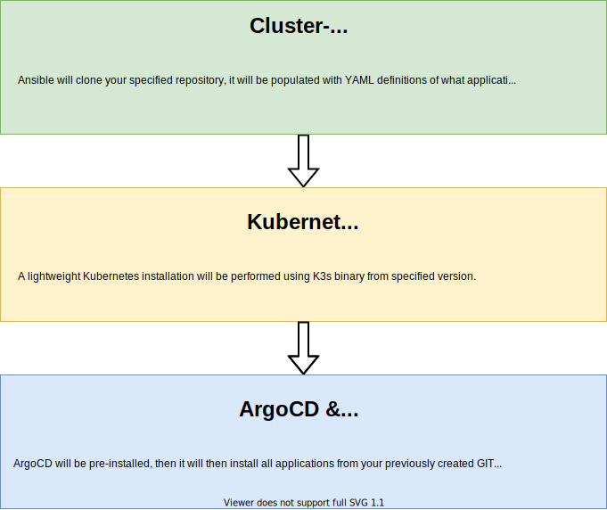
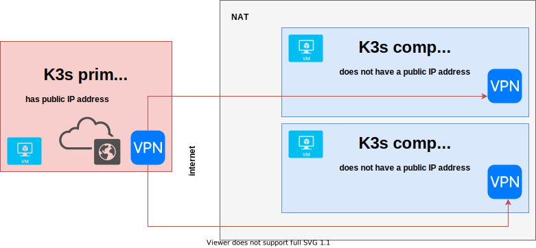

K3S Riotkit Cluster
===================

DANGER: This project is highly in WORK IN PROGRESS state. Subscribe this repository for releases if you want to be notified.

Creates a K3S single-node or multi-node cluster managed fully by ArgoCD.
Requires write access to GIT repository.

GitOps flow
-----------


How it is installed
-------------------



Proposed VPN setup
------------------

This Ansible setup can handle multiple setups:
- One primary, no any compute nodes
- One primary + multiple compute nodes in same network without VPN
- One primary + multiple compute nodes exposed via WireGuard VPN remotely



Architecture
------------

**Provided by K3S:**
- CoreDNS + Flannel: Networking
- Embedded service load balancer (Rancher's Klipper Load Balancer)
- SQLite3 (can be replaced with etcd, there is a migration possibility)
- WireGuard VPN (if wanting to use VPN)

**Of choice:**
- Cluster management: ArgoCD connected with a single "cluster-wide" GIT repository. Components synchronized on-click
- Gateway: Traefik + Let's Encrypt
- Health checks: Infracheck - health checks provided via HTTPS endpoint for external monitoring service (e.g. UptimeRobot)
- Metrics: Passing to centralized Telegraf instance
- Secrets management: https://github.com/bitnami-labs/sealed-secrets
- SMTP relay: https://artifacthub.io/packages/helm/docker-postfix/mail
- Backup: Bahub (todo)

Any of above components can be disabled in Ansible vars.

Security
--------

Kubernetes API is private, accessible only on `localhost:6443` and via VPN. ArgoCD is accessible on a public domain behind basic auth.

**Target security considerations**

1. Expose `Kubernetes Dashboard` and `ArgoCD` on separate HTTPS port
2. Use VPN to access `ArgoCD`, `Kubernetes API` and `Kubernetes Dashboard`

Installing 
----------

1. Create your own repository from this repository - use it as a template

2. Install roles from Ansible Galaxy

```bash
ansible-galaxy install -r requirements.yml
```

3. Prepare `playbook.yaml`, `inventory/hosts.yaml` - adjust variables to your needs

4. Put credentials - passwords and ssh keys in `inventory/group_vars/all.yaml`

5. Encrypt file `inventory/group_vars/all.yaml` using `ansible-vault encrypt inventory/group_vars/all.yaml`, so your passwords, ssh keys will stay secure while stored in GIT repository

6. Install inter-node VPN (skip if you don't connect multiple _compute nodes_ to remote _primary server_)

```bash
ansible-playbook ./playbook.yaml -k -i inventory/hosts.yaml --limit vpn
```

```bash
ansible-playbook ./playbook.yaml -k -i inventory/hosts.yaml --limit vpn-administrative
```

7. Install Kubernetes

8.1. Primary node at first

```bash
ansible-playbook ./playbook.yaml -k -i inventory/hosts.yaml -t k3s --limit k3s-primary
```

8.2. Next on compute nodes (if any)

```bash
ansible-playbook ./playbook.yaml -k -i inventory/hosts.yaml -t k3s --limit k3s-node
```


Upgrading
---------

Following upgrade commands will only execute 

### Compute node

```bash
ansible-playbook ./playbook.yaml -k -i inventory/hosts.cfg -t cluster --limit k3s-node -e force_k3s_upgrade=true
```

### Primary node

```bash
ansible-playbook ./playbook.yaml -k -i inventory/hosts.cfg -t k3s --limit k3s-primary -e force_k3s_upgrade=true
```


Management commands
-------------------

### Primary

- View logs: `journalctl --unit k3s --follow`
- Start: `systemctl start k3s`
- Stop: `systemctl stop k3s`
- List nodes: `k3s kubectl get nodes`
- Check node details: `kubectl describe node ...`

Using Sealed Secrets mechanism
------------------------------

After installing ArgoCD and synchronizing "sealed-secrets" application Ansible will store "sealed-secrets.cert.pem" file in `artifacts` local project directory.
Use `kubeseal` cli locally using this secret, or on the server using certificate at path `/etc/rancher/k3s/sealed-secrets.cert.pem`.

```bash
# on primary node
cat configmap.yaml | kubeseal --cert /etc/rancher/k3s/sealed-secrets.cert.pem

# locally
cat configmap.yaml | kubeseal --cert ./artifacts/sealed-secrets.cert.pem
```

Disconnecting nodes
-------------------

Procedure is to stop all pods, stop the agent, then delete the agent on primary.

```bash
# PART 1: On primary node
# stop all running pods on given machine
kubectl drain compute-xyz --ignore-daemonsets=true

# PART 2: On compute node
systemctl stop k3s-agent

# PART 3: On primary node - optionally, as this node will be anyway unschedulable 
# delete stopped agent from primary node list
kubectl delete node compute-xyz
```
